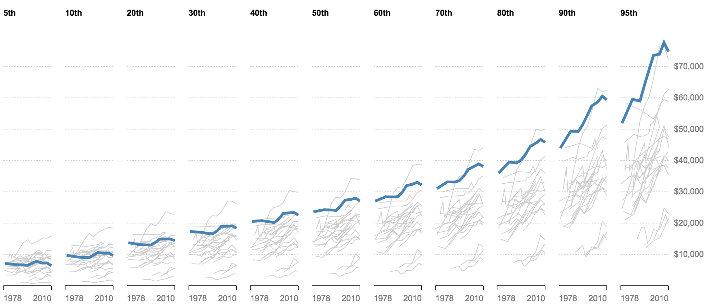
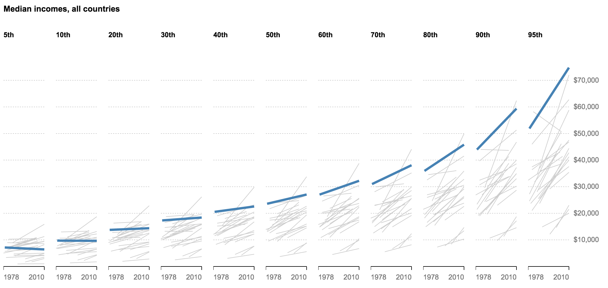

#Class 6: More nested data and a group exercise

##Housekeeping
Show + tell?
Any questions from Wednesday?

##Notes
* Discuss: why are trees and nesting so complicated?
  * d3.nest
  * nested selections
  * the [DOM](https://en.wikipedia.org/wiki/Document_Object_Model) and SVG
  * [JSON](https://en.wikipedia.org/wiki/JSON)
  * [CSS Selectors](http://css.maxdesign.com.au/selectutorial/)
  * JavaScript [Closures](https://developer.mozilla.org/en-US/docs/Web/JavaScript/Closures) (nested functions)
  * d3 [hierarchy](https://github.com/d3/d3-hierarchy#hierarchy) object (this is new but very useful)
  * Tree layouts: [dendrogram](http://bl.ocks.org/mbostock/e9ba78a2c1070980d1b530800ce7fa2b), [partition plot](https://bl.ocks.org/mbostock/1005873), [tremap](http://bl.ocks.org/mbostock/911ad09bdead40ec0061), [sunburst](https://bl.ocks.org/kerryrodden/7090426), [circle pack](http://bl.ocks.org/mbostock/3cba6ac2fac09e5483bf6c1fade733be)

##A brief chat about complex charts and mobile devices
Data visualization on mobile devices is something no one does particularly well at the moment. How successful are these? Which platform was each designed for? There's an inherent give-and-take in these kinds of "step-through" graphics. Check out both on mobile and desktop.
  - [A 3-D View of a Chart That Predicts The Economic Future: The Yield Curve](http://www.nytimes.com/interactive/2015/03/19/upshot/3d-yield-curve-economic-growth.html)
  - [The Facebook Offering: How It Compares](http://www.nytimes.com/interactive/2012/05/17/business/dealbook/how-the-facebook-offering-compares.html)
  - [Fewer Helmets, More Deaths](http://www.nytimes.com/interactive/2014/03/31/science/motorcycle-helmet-laws.html)
  - [How the Recession Reshaped the Economy, in 255 Charts](http://www.nytimes.com/interactive/2014/06/05/upshot/how-the-recession-reshaped-the-economy-in-255-charts.html)
  - [The Tenure Pipeline at Harvard Business School](http://www.nytimes.com/2013/09/08/education/harvard-case-study-gender-equity.html?ref=education)

## Class Goals
 * Get better at d3.nest(), including using a DOUBLE NEST
 * Take a chart from sketch to production, start to finish, using d3.nest()
 * Work on the 'fiddly bits' of charts -- the last 10 percent. Axes are hard!
 * More in-class coding to solidify skills
 * (Optional) Think about how to create one of these charts for mobile

##Using more complex hierarchy and data joins

5. Let's continue with the data from the previous class to make a more complex visualization: a comparison of the full distribution at each income level, highlighting the US in each. You may need to nest on two things to do this. Even getting this sketch would be a win:

  Feel free to start with [this HTML](starter.html), with this as our goal.

  

  If you have time, try to get it closer to this. It gets complicated quickly!

  

  It's just one line to make this more simplified version, if you prefer:

  

